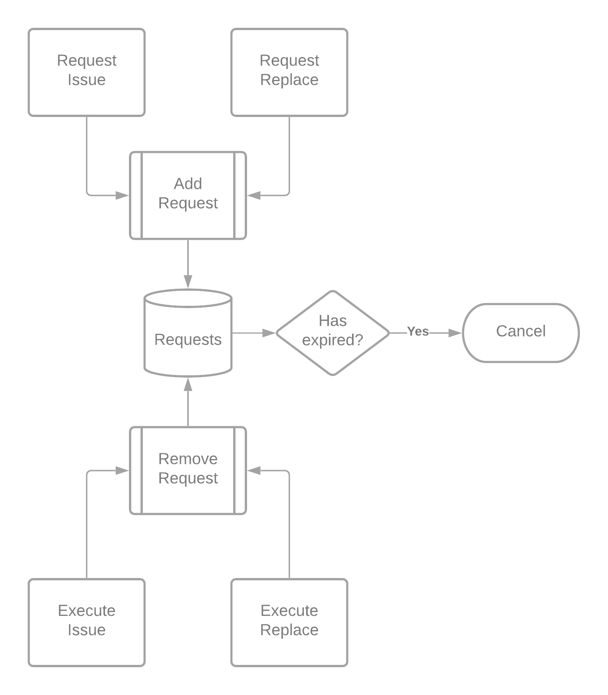

# Cancellation Processes

To release locked collateral from a failed Issue or Replace request, the Vault must trigger cancellation upon expiry. The Vault is incentivized to do so to unblock its collateral (for further interBTC rewards) and will also claim the griefing collateral locked by the original participant.

  
    
  <b>Cancellation Flowchart</b>

