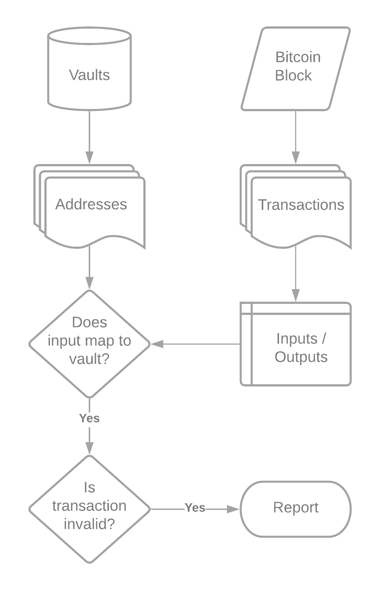

# Theft Processes

Vaults monitor incoming transactions on Bitcoin and report theft if BTC is moved outside the protocol. They are rewarded with a theft fee from the liquidated vault's holdings.

  
    
  <b>Theft Flowchart</b>

